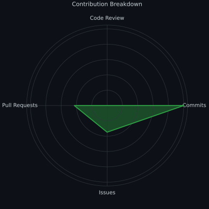

- 👋 Hi, I’m @Viverun  
- 🐍 Python Backend Developer  
- 🤖 AI & Machine Learning Enthusiast  
- 🖥️ Computer Engineering × Building Open source alternative  
- 🔭 Astronomy & Scientific Computing Intelligent Systems
- 📐 Passionate about applying Mathematics within Engineering & AI  
- 🌐 Specializing in Django & Django REST Framework  
- ☁️ Exploring cloud technologies, especially GCP   
- 💞️ Open to collaborating on innovative and technical projects  
- 📫 Reach me at: khanjamilahmed202@gmail.com

## 📊 Contribution Breakdown

