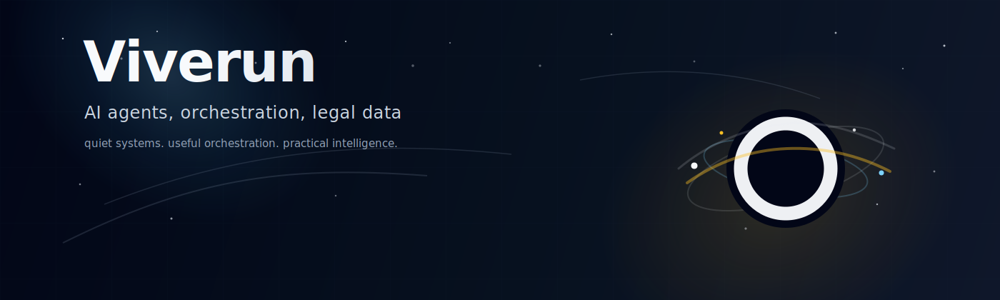

<em>Calm systems for AI agents, multi-agent orchestration, legal data, and useful automation.</em>

<table>
  <tr>
    <td width="58%" valign="top">

<strong>Focus</strong>

<ul>
  <li>Multi-agent orchestration and automation.</li>
  <li>AI tooling for legal and civic workflows.</li>
  <li>Python backends, APIs, and data pipelines.</li>
</ul>

<strong>Stack</strong>

<code>Python</code> · <code>FastAPI</code> · <code>Django</code> · <code>Flask</code> · <code>Docker</code> · <code>PostgreSQL</code> · <code>Redis</code> · <code>GCP</code>

    </td>
    <td width="42%" valign="top">

<strong>Current signal</strong>

<blockquote>

<!-- START_QUOTE -->

<em>We are a way for the cosmos to know itself.</em> Carl Sagan

<!-- END_QUOTE -->

</blockquote>

<strong>Selected work</strong>

<a href="https://huggingface.co/datasets/Viverun/jits-legal-dataset">jits-legal-dataset</a> for Indian court judgments.

    </td>
  </tr>
</table>

  <a href="https://github.com/Viverun">GitHub</a> ·
  <a href="https://linkedin.com/in/Viverun">LinkedIn</a> ·
  <a href="mailto:khanjamilahmed202@gmail.com">Email</a>

